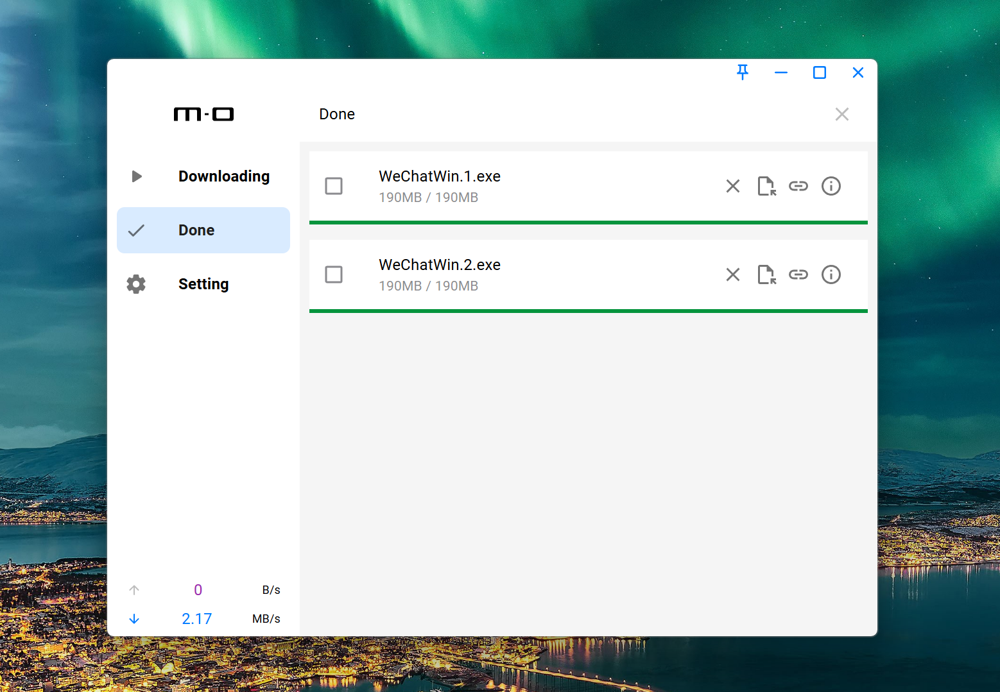
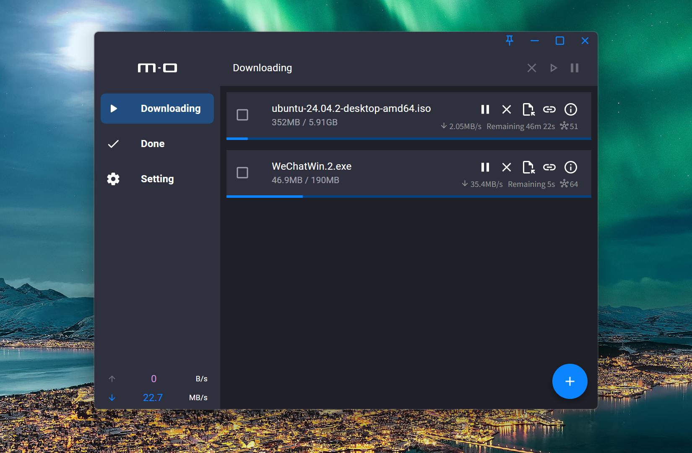

# tauri-motrix

> It is still under development and there is still a lot to be improved

**Use Tauri to refactor [Motrix](https://github.com/agalwood/Motrix) project.**





## ✨ Features

- 🚀 Supports 128 threads in a single task
- Material UI

## Devolvement

```Powershell
pnpm run check # ensure fetch

pnpm run tauri dev
```

## Acknowledgements

Thanks to the following projects for giving me inspiration and reference:

- [Clash Verge](https://github.com/clash-verge-rev)
- [Motrix](https://github.com/agalwood/Motrix)
- [Aria2](https://github.com/aria2/aria2)
- [Aria2.js](https://github.com/sonnyp/aria2.js)
- [Axios](https://github.com/axios/axios)

## License

GPL-3.0 License. See [License here](./LICENSE) for details.
